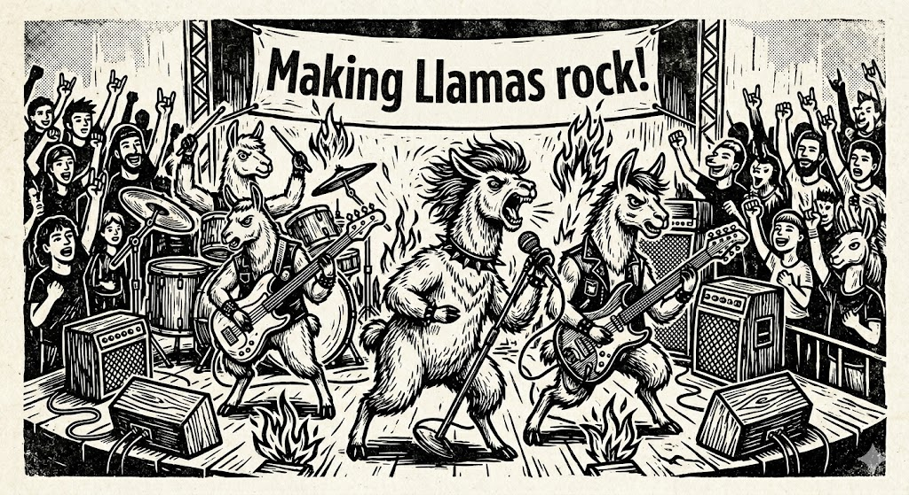

# 🦙 Making Llamas Rock!




A streamlined, optimized, and zero-headache `Makefile` for downloading and running local Large Language Models (LLMs) using `llama.cpp` and `podman`. 

Currently configured out-of-the-box for **AMD GPUs (ROCm)**, but easily adaptable for NVIDIA or CPU-only setups.

## ✨ Features
- **Effortless Downloads:** Fetch `.gguf` models directly from Hugging Face or via direct URLs using clean syntax.
- **Dynamic Argument Parsing:** Run commands naturally like `make run my_model.gguf` without dealing with messy environment variable syntax.
- **Hardware Optimized:** Tuned defaults for running alongside the OS (smart CPU thread allocation, maximum GPU layer offloading).
- **Persistent Logging:** Container logs can be optionally piped to a local `llama-logs/llama-server.log` file while preserving standard terminal access.

## 📋 Prerequisites
- Linux Environment
- [Podman](https://podman.io/) installed
- [Hugging Face CLI](https://huggingface.co/docs/huggingface_hub/guides/cli) (`hf`) installed for downloading from Hugging Face repositories.
- An AMD GPU with ROCm drivers installed (if using the default image).

## 🚀 Quick Start

### 1. Download a Model
You can download models straight from Hugging Face by providing the repository ID and the exact filename:
```bash
# Download via Hugging Face CLI
make download TheBloke/Llama-2-7B-Chat-GGUF llama-2-7b-chat.Q4_K_M.gguf

# OR Download via direct URL
make download URL=https://huggingface.co/TheBloke/Mistral-7B-Instruct-v0.1-GGUF/resolve/main/mistral-7b-instruct-v0.1.Q4_K_M.gguf
```

### 2. Run the Model
Start the server and automatically mount the model into the container. (Any existing llama-server instances will be gracefully stopped first).
```bash
make run llama-2-7b-chat.Q4_K_M.gguf
```

### 3. Check Logs
Watch the server generate responses or debug loading times:
```bash
make logs
```
*(If you enabled file logging, logs are also saved to `./llama-logs/llama-server.log`)*

### 4. Stop the Server
```bash
make stop
```

### 5. Check Server Status
Verify that the container is running or hit the `/health` endpoint to ensure the model is ready:
```bash
make status  # Shows container status
make check   # Tests the /health endpoint
```

### 6. Update the Server
Easily fetch the latest `llama.cpp` image without disrupting an active session:
```bash
make pull
```

---

## ⚙️ Tuning & Configuration

You can permanently change variables inside the `Makefile` or pass them dynamically when running a command.

```bash
N_GPU_LAYERS=24 THREADS=4 make run model.gguf
```

### Available Variables

| Variable | Default | Description |
| :--- | :--- | :--- |
| `ENGINE` | `podman` | The container runtime engine (e.g., `podman` or `docker`). |
| `DEVICES`| `--device /dev/kfd --device /dev/dri` | Hardware acceleration arguments. |
| `PORT` | `8080` | The port exposed to your host machine. |
| `N_GPU_LAYERS` | `99` | Number of layers to offload to the GPU. Keep at 99 for full offload, or lower it if you face VRAM pressure. |
| `N_CTX` | `4096` | Context window size. Increase for larger document processing (requires more RAM/VRAM). |
| `THREADS` | `6` | CPU threads allocated to model execution. **Pro-tip:** Leave 2-4 physical cores free for your OS! |
| `ENABLE_FILE_LOGGING`| `false` | Set to `true` to pipe server output to a text file. |
| `LOG_DIR` | `$(CURDIR)/llama-logs` | The directory where log files are stored. |
| `MODELS_DIR` | `$(CURDIR)`| The directory where models are downloaded and read from. |
| `CONTAINER_NAME`| `llama-server`| Name of the container. |

---

## 🛠️ Switching to NVIDIA (CUDA)
If you want to run this on an NVIDIA GPU, simply override the `IMAGE` and `DEVICES` variables (and `ENGINE` if using Docker):

```bash
ENGINE=docker DEVICES="--gpus all" IMAGE=ghcr.io/ggml-org/llama.cpp:server-cuda make run model.gguf
```

Or change them permanently inside the `Makefile`:
```makefile
ENGINE ?= docker
DEVICES ?= --gpus all
IMAGE ?= ghcr.io/ggml-org/llama.cpp:server-cuda
```

---

## 📄 License
This project is licensed under the MIT License - see the [LICENSE](LICENSE) file for details. Feel free to use it, tweak it, and share it!
